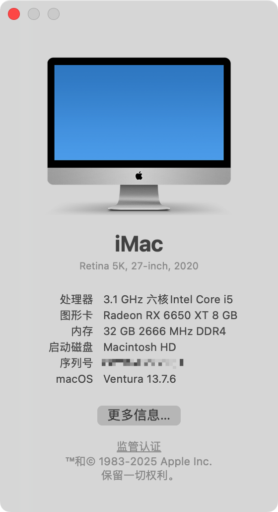
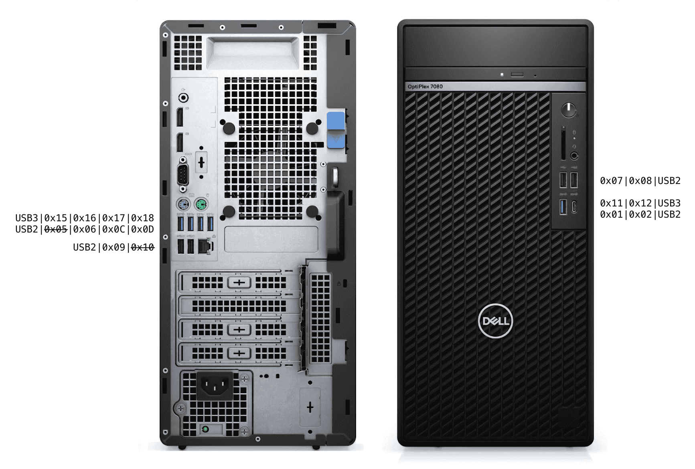

# Hackintosh: Dell OptiPlex 7080 MT  
**OpenCore Bootloader 1.0.5 | Tested on macOS Ventura 13.7.6**  

## Introduction  
Before logging into your iCloud account, you must [generate a new SMIBIOS](https://github.com/corpnewt/GenSMBIOS).  

## Hardware Specifications  
- **System**: [Dell OptiPlex 7080 Tower](https://www.dell.com/en-us/work/shop/desktops-all-in-one-pcs/optiplex-7080-tower-and-small-form-factor/spd/optiplex-7080-desktop)  
- **CPU**: [Intel® Core™ i5-10500](https://www.intel.com/content/www/us/en/products/sku/199277/intel-core-i510500-processor-12m-cache-up-to-4-50-ghz/specifications.html) (6C/12T)  
- **iGPU**: Intel® UHD Graphics 630  
- **dGPU**: [ASRock AMD Radeon™ RX 6650 XT Challenger D 8GB OC](https://www.asrock.com/Graphics-Card/AMD/Radeon%20RX%206650%20XT%20Challenger%20D%208GB%20OC/)  
- **RAM**: 32GB DDR4 2666 MHz (Dual Channel)  
- **Storage**: Hikvision HS-SSD-C2000Pro 1TB NVMe  
- **Disk Burning**: PLDS DVD+/-RW DU-8A5LH (Internal) + HP CDDVDW TS-H653T (External)
- **Ethernet**: Solarflare SFN6122F (Dual-Port SFP+, 10Gbps) + Intel I219LM11 (1Gbps)  
- **Wireless**: BCM94360CS2 (Wi-Fi/Bluetooth)  

## Functional Components  
✅ **Working**  
- CPU power management (Turbo Boost, SpeedStep)  
- GPU acceleration (iGPU + dGPU)  
- Audio (Internal speaker, front/back panel outputs, DisplayPort outputs)  
- USB (All ports except 2 intentionally disabled USB2 ports)  
- Networking (10Gbps LAN + 1Gbps LAN + Wi-Fi)  
- Internal & external CD/DVD drives
- Sleep/Wake functionality  
- Apple Continuity (AirDrop, Auto Unlock, Handoff, Sidecar, Universal Control, etc.)  
- macOS OTA updates

⚠️ **Not Working**  
- DRM content playback (requires Apple T2 security chip)  

## BIOS Configuration  
### Recommended Settings  
- **System Configuration**  
  - Serial Port: `Disabled`  
  - SATA Operation: `AHCI`  
- **Video**  
  - Multi Display: `Enabled`  
  - Primary Display: `Auto`  
- **Security**  
  - PTT Security: `Disabled`  
  - Secure Boot: `Disabled`  
- **Advanced**  
  - Intel® SGX™: `Disabled`  
  - VT for Direct I/O: `Enabled`  

### Advanced Modifications  
Using [RU.efi](https://github.com/JamesAmiTw/ru-uefi) for BIOS editing:  
1. **Disable CFG Lock**:  
   - Navigate to `CPUSetup` → Set `003E` to `0x00`  
2. **Configure DVMT**:  
   - Navigate to `SASetup` → Set `00F5` to `0x02` (64MB pre-allocation)  

## Post-Installation  
### USB Mapping

- Port `0x15` is a 10Gbps port.
- Ports `0x05` and `0x10` have been disabled to comply with macOS USB port limitations.
- Follow [Dortania's USB mapping guide](https://dortania.github.io/OpenCore-Post-Install/usb/manual/manual.html) for optimal port configuration.  

### ACPI Customization
1. Generate base SSDTs using [SSDTTime](https://dortania.github.io/Getting-Started-With-ACPI/ssdt-methods/ssdt-easy.html#running-ssdttime).
2. Add [SSDT-HPET.aml](https://dortania.github.io/Getting-Started-With-ACPI/Universal/irq.html) to resolve IRQ conflicts.